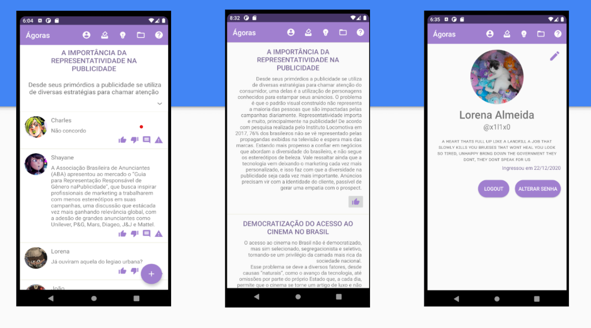

<h1 align="center">Ágoras: plataforma de debates, para desenvolvimento da capacidade argumentativa.</h1>

  <a href="#objetivo">Objetivo</a>&nbsp;&nbsp;&nbsp;|&nbsp;&nbsp;&nbsp;
  <a href="#desenvolvimento-do-projeto">Desenvolvimento do Projeto</a>&nbsp;&nbsp;&nbsp;|&nbsp;&nbsp;&nbsp;
  <a href="#minimundo">Minimundo</a>&nbsp;&nbsp;&nbsp;|&nbsp;&nbsp;&nbsp;
  <a href="#tecnologias">Tecnologias</a>

## Objetivo:

Espaço para debate de situações atuais ou não, os quais são definidos por meio de votações da prória comunidade.

## Desenvolvimento do Projeto

- [Anteprojeto](https://docs.google.com/document/d/1rIUU_1d4YRY0bucZs65Q4BtO76U0_Dm4xr_0uJM2GXY/edit)
- [PMC](https://docs.google.com/presentation/d/16kT38kjHIuf2yD1MX85rqYa5F9df-fTbPv3vTfjTOHM/edit#slide=id.ge20873777b_0_0)
- [Wireframe Mobile](https://docs.google.com/presentation/d/1FH3wKA5VDobz2nH1XQn04hySsuKiL8jbI8FPiBvk_LE/edit#slide=id.p)
- [Revisão de Usabilidade - v2](https://docs.google.com/presentation/d/1BM7qXLzoxKnBRL-9RGgnqd7QCGWWeyt0OJdPmUYGb3Q/edit)
- [BackLog de Requisitos](https://docs.google.com/presentation/d/1jW-Cbx0AoiGDH5Zu0EbL8PuKjo8sWQ3KjcSkikphRSc/edit#slide=id.p)
- [Revisão de Processos v1](https://docs.google.com/presentation/d/133IfI67cq-7Sj4LR1dAW5jw1gj282Ig837o0iHb-mb4/edit#slide=id.ge950579e59_0_10)
- [Revisão de Processos v2](https://docs.google.com/presentation/d/1beIUpdqfJ5grQQnkaybq7MH6IiO03DcXGD5vRNSf-ss/edit#slide=id.gfbcbaff1bc_0_54)
- [Tecnologias Utilizadas](https://docs.google.com/presentation/d/13NfGg9uX6wDPxrB7n9dv4xdxGMuL1fZP8dORHts2kFE/edit#slide=id.geb0675a293_0_157)
- [Repositório - Ágoras Web - PHP](https://github.com/IAteYourKookie/AgorasWeb)
- [Heroku](https://projdebate.herokuapp.com/)

---

- [BackEnd Implementação](https://docs.google.com/presentation/d/1pRx8cqCIQn6nVzLVvfFIHzXtZ5J4ZK475541Z77xluU/edit#slide=id.gfa72e7d6c2_2_0)
- [Modelo de Classes](https://docs.google.com/presentation/d/1rSS3tW8vCOB5hSUD1Azbey_I8t6m8jFMYslBQ8r2H8U/edit#slide=id.p)
- [Código SQL - BD](https://docs.google.com/presentation/d/1CrR9VVsL2LR1gIJw46n70WQc1p43m60OOj6Z2XKNYRA/edit#slide=id.p)
- [Planejamento de 2 semanas](https://docs.google.com/presentation/d/117zuiRN8lEh9fXq7Mh0wgLEq6j2CMA9I0_nQ5vsjr-M/edit#slide=id.g106a290efd9_0_10)
- [Plano de Testes - Slide](https://docs.google.com/presentation/d/1tsIXb40ynTqoQFKlGAo_cO3eGclcIdoxulUQfdy-2ro/edit#slide=id.p)
- [Plano de Testes - Planilhas](https://docs.google.com/spreadsheets/d/1hlJXMdrNZN33beMeTxheXadmKp976s1fFt3Wjw2Snd8/edit#gid=0)
- [Slide de Apresentação Final](https://www.canva.com/design/DAEy0gpYtEk/p8jOZ7pgbnsaNZTS13oHlg/view?utm_content=DAEy0gpYtEk&utm_campaign=designshare&utm_medium=link&utm_source=sharebutton)

## Minimundo

Com um volume cada vez maior de informações no mundo atual, é importante que as pessoas estejam preparadas para processá-las e argumentar sobre. Nosso projeto procura prover um sistema de discussão para os usuários sobre um tema escolhido. É importante um perfil para a identificação de cada usuário e que seja personalizável. As informações do usuário serão armazenadas como nome, nome de usuário, email, senha. Para armazenamento dos temas incluiremos título, um usuário, descrição e data de início e fim. Poderá cadastrar vários temas e a votação (ininterrupta) só pode ser feita uma única vez em cada tema. No comentário serão armazenados os códigos de comentário e discussão, uma data e hora, o texto do comentário e o código de usuário. A participação acontecerá com os usuários interagindo com um tema, comentando outras postagens e votando no próximo que desejam discutir. O envio de sugestões poderá ser feito a qualquer momento.

> Baixe a app pelo link: [APK - Ágoras](https://drive.google.com/drive/folders/1D4edBTT96XxUQaqOvLWbzfcn0-i0Ls3G)

## Tecnologias

Esse projeto está sendo desenvolvido com as tecnologias:

&nbsp;
&nbsp;
&nbsp;

### Banco de Dados

&nbsp;

### IDE

&nbsp;

### Versionamento, código-fonte, MarkDown
&nbsp;
&nbsp;
&nbsp;

# Versões do Sistema Mobile - Android Studio

## Telas do Front-End - Java

- [x] Tela de Inicio
- [x] Tela de Votação
- [x] Tela de Login
- [x] Tela de Cadastro
- [x] Tela de Ajuda
- [x] Tela de Perfil
- [x] Tela de Chat Debate
- [x] Tela de Sugestão

## Andamento da aplicação do BackEnd - PHP

- [x] BD Login
- [x] BD Cadastro
- [x] BD Debate
- [ ] BD Tema - Em andamento
- [ ] BD Comentário - Em andamento
- [ ] BD Curtida - Em andamento
- [ ] BD Edição de Perfil e Senha e Foto - Em andamento

### 1ª Versão BD

- [x] BD Login
- [x] BD Cadastro

### 2ª Versão BD

- [x] BD Login
- [x] BD Cadastro
- [x] BD Debate

### 3ª Versão BD - Totalmente Funcional

- [x] BD Login
- [x] BD Cadastro
- [x] BD Debate
- [x] BD Tema
- [x] BD Comentário
- [x] BD Curtida
- [x] BD Edição de Perfil, Senha e Foto

## Cores Principais

| Cores              | Códigos |
| ------------------ | :-----: |
| Roxo               | #A07FCF |
| Preto              | #000000 |
| Branco             | #FFFFFF |
| Amarelo Background | #F5E44C |
| Amarelo Border     | #F2EA9D |

---

Feito com ♥ Charles Junior, Lorena Almeida e Shayane Teixeira

